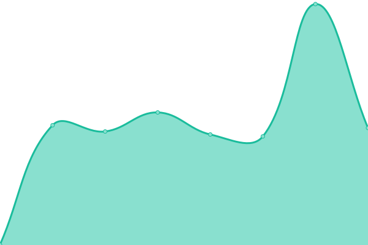
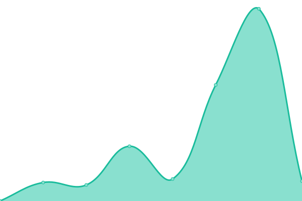
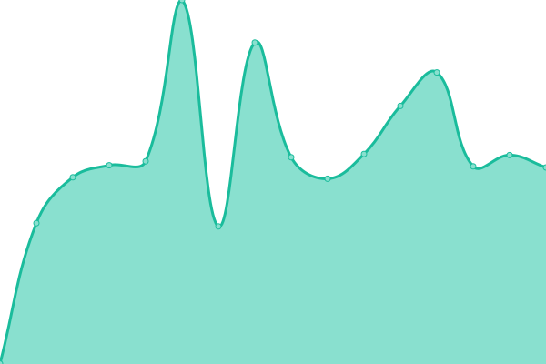
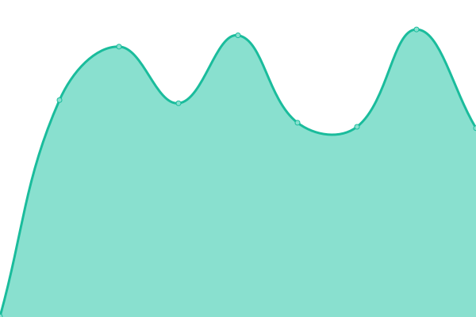

# [📈 Live Status](https://status.chiadochain.net): <!--live status--> **🟧 Partial outage**

This repository contains the open-source uptime monitor and status page for [Gnosis](https://gnosis.io), powered by [Upptime](https://github.com/upptime/upptime).

With [Upptime](https://upptime.js.org), you can get your own unlimited and free uptime monitor and status page, powered entirely by a GitHub repository. We use [Issues](https://github.com/gnosis/chiado-uptime/issues) as incident reports, [Actions](https://github.com/gnosis/chiado-uptime/actions) as uptime monitors, and [Pages](https://status.chiadochain.net) for the status page.

<!--start: status pages-->
<!-- This summary is generated by Upptime (https://github.com/upptime/upptime) -->
<!-- Do not edit this manually, your changes will be overwritten -->
<!-- prettier-ignore -->
| URL | Status | History | Response Time | Uptime |
| --- | ------ | ------- | ------------- | ------ |
|  [RPC](https://rpc.chiadochain.net/) | 🟥 Down | [rpc.yml](https://github.com/gnosischain/chiado-uptime/commits/HEAD/history/rpc.yml) | 

 1128ms
     
 | 

<a href="https://status.chiadochain.net/history/rpc">100.00%</a>
    

|  [GatewayFM Public RPC](https://rpc.chiado.gnosis.gateway.fm/) | 🟩 Up | [gateway-fm-public-rpc.yml](https://github.com/gnosischain/chiado-uptime/commits/HEAD/history/gateway-fm-public-rpc.yml) | 

 537ms
     
 | 

<a href="https://status.chiadochain.net/history/gateway-fm-public-rpc">100.00%</a>
    

|  [Beacon RPC](https://rpc-gbc.chiadochain.net/eth/v1/beacon/headers) | 🟥 Down | [beacon-rpc.yml](https://github.com/gnosischain/chiado-uptime/commits/HEAD/history/beacon-rpc.yml) | 

 2179ms
     
 | 

<a href="https://status.chiadochain.net/history/beacon-rpc">100.00%</a>
    

|  [Blockscout](https://blockscout.com/gnosis/chiado) | 🟩 Up | [blockscout.yml](https://github.com/gnosischain/chiado-uptime/commits/HEAD/history/blockscout.yml) | 

 1407ms
     
 | 

<a href="https://status.chiadochain.net/history/blockscout">100.00%</a>
    

|  [Explorer](https://blockscout.chiadochain.net/) | 🟩 Up | [explorer.yml](https://github.com/gnosischain/chiado-uptime/commits/HEAD/history/explorer.yml) | 

 1253ms
     
 | 

<a href="https://status.chiadochain.net/history/explorer">100.00%</a>
    

|  [Beacon Explorer](https://beacon.chiadochain.net/) | 🟩 Up | [beacon-explorer.yml](https://github.com/gnosischain/chiado-uptime/commits/HEAD/history/beacon-explorer.yml) | 

 887ms
     
 | 

<a href="https://status.chiadochain.net/history/beacon-explorer">100.00%</a>
    

|  [Forkmon](https://forkmon.chiadochain.net/) | 🟩 Up | [forkmon.yml](https://github.com/gnosischain/chiado-uptime/commits/HEAD/history/forkmon.yml) | 

 379ms
     
 | 

<a href="https://status.chiadochain.net/history/forkmon">99.87%</a>
    

|  [Forkmon ETH2](https://eth2-forkmon.chiadochain.net/) | 🟥 Down | [forkmon-eth-2.yml](https://github.com/gnosischain/chiado-uptime/commits/HEAD/history/forkmon-eth-2.yml) | 

 201ms
     
 | 

<a href="https://status.chiadochain.net/history/forkmon-eth-2">32.27%</a>
    

|  [Ethstats](https://ethstats.chiadochain.net/) | 🟩 Up | [ethstats.yml](https://github.com/gnosischain/chiado-uptime/commits/HEAD/history/ethstats.yml) | 

 462ms
     
 | 

<a href="https://status.chiadochain.net/history/ethstats">99.88%</a>
    

<!--end: status pages-->

[**Visit our status website →**](https://status.chiadochain.net)

## 📄 License

- Powered by: [Upptime](https://github.com/upptime/upptime)
- Code: [MIT](./LICENSE) © [Gnosis](https://gnosis.io)
- Data in the `./history` directory: [Open Database License](https://opendatacommons.org/licenses/odbl/1-0/)
